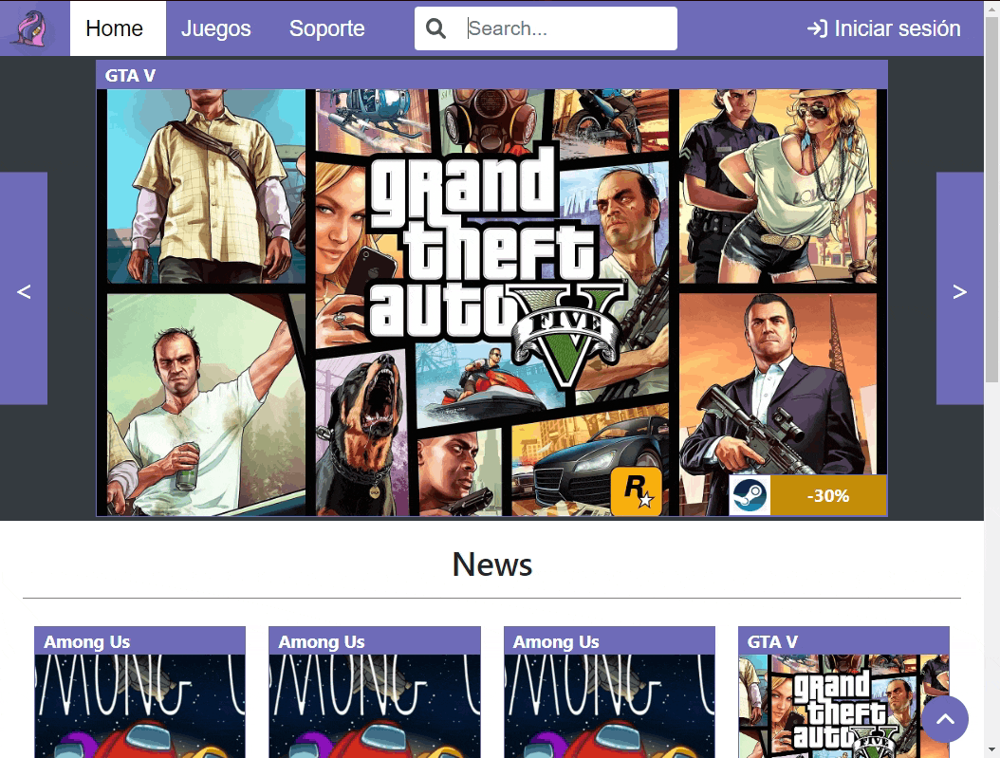
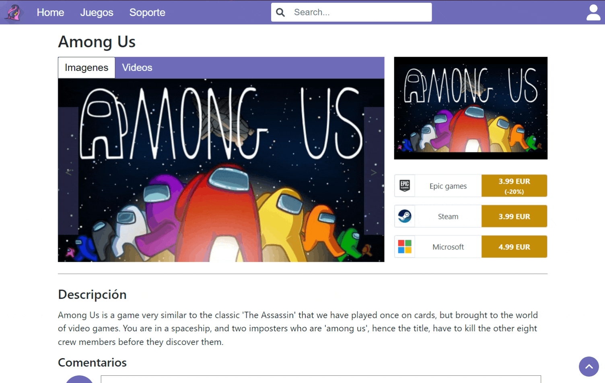
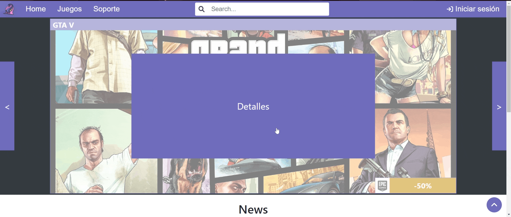
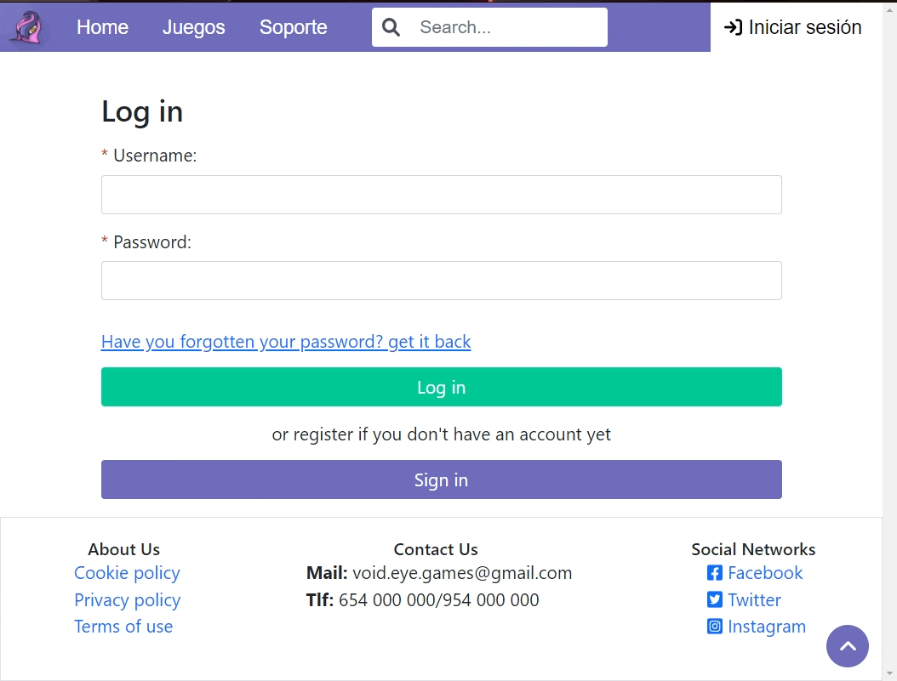
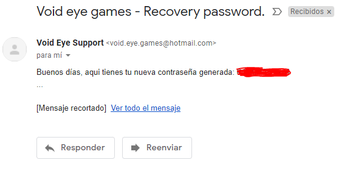
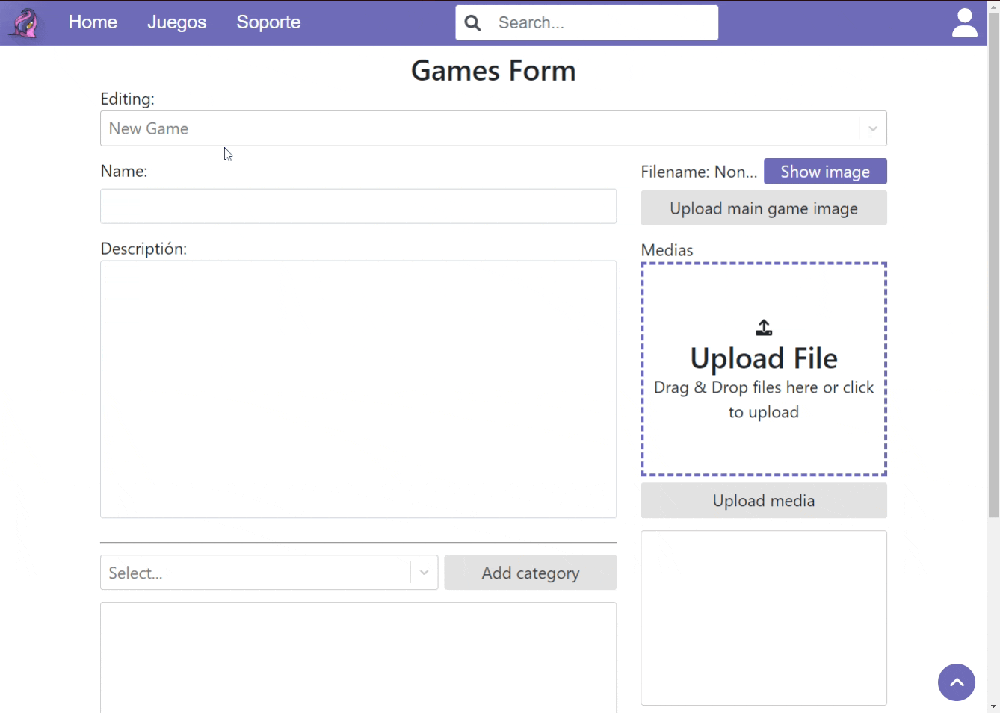
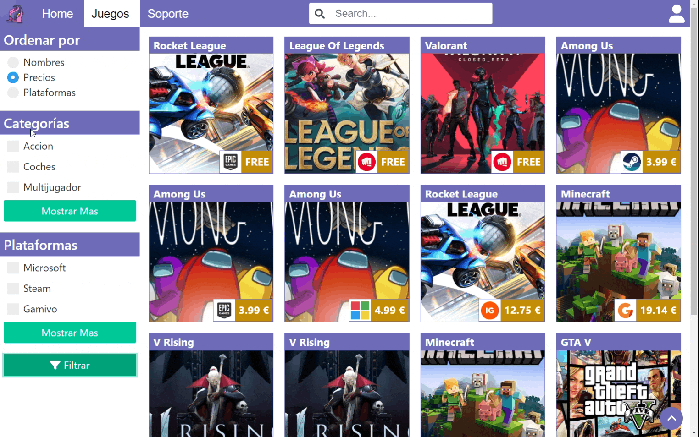
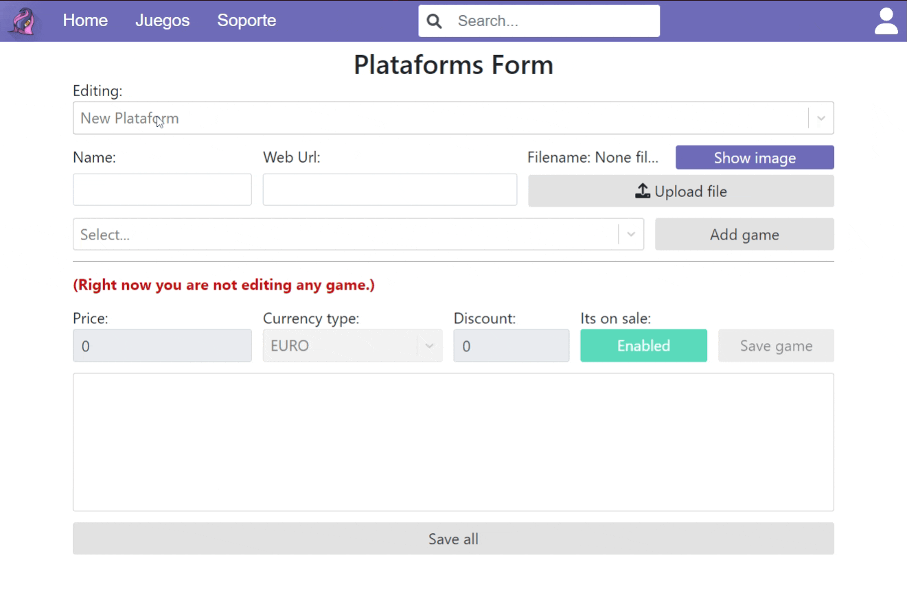

# Battery examples
**Project:** Void Eye Games
**Author:** Jose Antonio Duarte Pérez
**Tutor:** Jose Antonio Piñero Berbel
**Centro:** I.E.S. Francisco Ayala
**Departamento:** Dpto. Informática - 2º DAW

## Sumary
In this Markdown file, you will be able to see different examples of the characteristics and functionalities of each page, with a brief explanation of what is done in each one.

**IMPORTANT!!! the Battery examples files its a markdown because it is what best allows the use of gifs, as you will understand, a normal pdf does not have gifs.**

## Home page example
We use the slider a bit and show you the navigation bar.

## Games page example
In this example, we show the search by name through the navigation bar, the ordering and filtering by categories and platforms on the games in the list.

Here you have an example of the search by name in other view:

## Game details page example
See how the details of the games are, with their available platforms and media, below the comments and the possibility of commenting (only if you are logged in of course).

Here you have an example of how to comment on a game:

## Support page example
We show you a little information from the support page, in addition to its usable geolocator.

## Report form page example
An example of how to send a bug report to support and how the support receives it:

## Sign in form page example
A clear example of how to register on the page:

## Log in form page example
An example of how to log in to the page:

And here is an example of how to recovery password:

And here is the respective received email:

## ADMIN SIDE - Game form page example
An example of how to add a game to the database (only for administrators).
For this, we check that it does not exist by looking for it in the dropdown, and we add the name, description, then we upload the main image and add the stockings that the game will contain, to finish we select the categories to which it belongs, with this we will already have the game added , now, it still won't show up because there is no platform that is selling it, so let's add it to a platform.

## ADMIN SIDE - Category form page example
In this form the categories are created and edited, in the following example, you will see how I select an already created one and edit it, changing its name and removing a game..

## ADMIN SIDE - Plataform form page example
This could be the most complex form, as you can see, here we create/edit the platforms, adding a name, URL and their logo, then, to add games to it, we select one from the dropdown list, and then the data fields that relate the platform and the game are enabled, we edit them and click on the "add game" button and it will be added to the list, once the game is on the list, you can remove it from it or edit it to _change the price/etc_, **IMPORTANT for a game to appear, it has to be related to a platform and enabled (the green button next to save game)**. When we finish we press "Save all" and we can go to verify that it exists.

