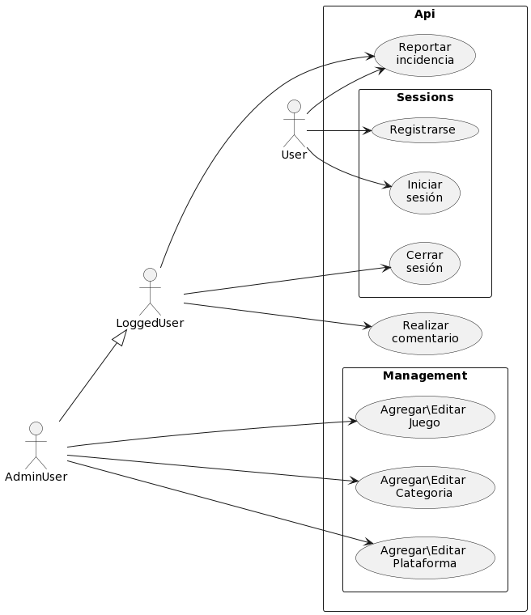
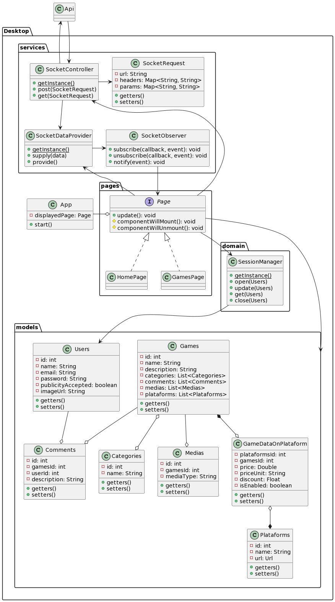
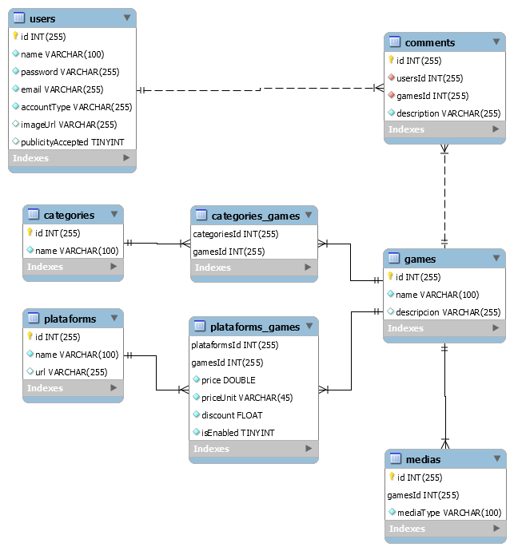

# Enterprise User Manual
**Project:** Void Eye Games
**Author:** Jose Antonio Duarte Pérez
**Tutor:** Jose Antonio Piñero Berbel
**Centro:** I.E.S. Francisco Ayala
**Departamento:** Dpto. Informática - 2º DAW

## Summary
### Spanish
Proyecto final de 2ºDAW, es una web destinada al apoyo en la búsqueda de las mejores ofertas y alternativas a la hora de comprar videojuegos. Además, junto a la descripción detallada de los videojuegos que se realizarán a través de vídeos e imágenes, encontrarás los diferentes enlaces a webs de compra y una serie de comentarios escritos por los usuarios. También podrán reportar errores a los desarrolladores y ver la ubicación de nuestra empresa en un mapa. En definitiva, una página que ayuda a los clientes a ver en qué página se vende a mejor precio y los diferentes precios a la hora de comprar videojuegos. Recuerda que en esta página no se pueden comprar juegos, ya que su finalidad es la consulta, y no la compra de videojuegos.

### English
Final project for 2ºDAW, it’s a website is intended for support in the search for the best offers and alternatives when buying video games. In addition, together with the detailed description of the video games that will be made through videos and images, you will find the different links to purchase websites and a series of comments written by users. They will also be able to report bugs to developers and view the location of our company on a map. In short, a page that helps customers to see on which page it is
sold at the best price and the different prices at the time to buy video games. Remember that games cannot be purchased on this page, since its purpose is consultation, and not the purchase of video games.

## The problem to solve
_“It is difficult to find a platform where they sell you a game cheaply, and the one I know is worth a lot, so I better not buy it.”_, this is the problem that was found, so the purpose of this project is to create a web page in which: _“Page that helps customers to see which page is sold at the best price and the different prices when buying video games.”_

To solve/make this, we have these objectives:
- That a user can view the price of video games on each platform.
- That a user can consult the details in more depth about a game.
- That a user can comment on a game.
- That a user can report bugs to the developers.
- That a user can consult a specific game quickly.

Regarding the organization of the same we plan to carry out the following specifications:
- The application will have an API, and will be available on PC (browser) and Mobile (such as app).
- The API will be made with PHP (with Slim Framework).
- The PC and Mobile part will be made with React (they will not have a PHP part to be able to make easier the creation of both the mobile part and the PC part, since the code will be similar between both).
- The layout of the page will be done with Bootstrap (and therefore Sass).
- In this project, games will be updated and added through the 'Admin' users, while that normal user will be able to comment on them.
- For the consultation of the game data / price update, it will be done by hand, previously mentioned to use some API provided by  RápidAs, but the one that was free and was going to use seems to be abandoned and the others are paid.

## Technology
Seeing what I want to do, and researching, I have been able to find the best tools to do this.

### Visual Studio
I decided on this IDE because of its great flexibility, it can support all types of languages easily and provide many conveniences with the plugins it brings, from database control to Git default management.

### Git
This clearly could not be missing for version control; thanks to it I have issues/versions and complete control for error handling.

### NodeJs y Composer
For the development of a web page, and an API, I have chosen these execution environments due to their large number of dependencies available.

### Slim Framework
Slim framework is a small PHP framework that includes the most basic, Router and ORM (with Atlas) perfect for the development of an API in PHP.

### React
With React, the management/development of the pages of our website will be facilitated in a more efficient and orderly way.

### Bootstrap y Sass
For the development of the styles of the page, Bootstrap and SASS could not be missing, thanks to these libraries, we will take a great weight off our shoulders.

### Hardware and software requirements
The requirements of this project are quite basic, it only depends on a Windows/Linux server with:
- An apache server with php installed.
- A relational database installed (Mysql/MariaDB).
- Have NodeJS and Composer installed.

You can follow the Installation steps if you need a guide on how to install the project.

## Analysis and design
### Use case diagrams


### Class diagrams
#### API class diagrams


#### Client class diagrams


### ERM Diagram


## Implementation
### Styles
- **App.css**: they are all the custom SCSS packed in a CSS, the documentation will be found in the SCSS files.
- **Boostrap.min.css**: the Basic CSS of bootstrap.

### Forms
You can see all the forms with their descriptions and important data in the Client User Manual.

### Data sending functions, connections, queries and selection of the database
You can see everything about the data sending functions, connection, queries and selection of the database in the API user manual (company user manual).

### Configuration file
The application is made so that you do not have to change anything in the configuration, but if you want to change it, here is a brief summary of each part.

#### API Side
In the API, you have a file called _“SlimSettings.php”_ here you can configure database access in addition to the _“Slim framework”_.

However, I recommend you to edit the environment variables in the **.htaccess**, which is faster.

#### Client Side
On the client side, there are different configuration files depending on the environment in which it is running, if we talk about production, its configuration file is _“.env.production”_, and if it is in development, it will be _“.env.development”_.

## Relationship details of each of the files
There are a lot of files/files, so it has been decided to put the details at the beginning of each of these
files in the code.

## Evaluation and test
### API Side
The **tests** carried out on the API have been carried out through Postman, you have the import file in: _“docs/requests/VoidEyeGames.postman_collection.json”_, remember to import these requests from **Postman**.

### Client Side
The **tests** carried out for the clients were carried out by hand.

### Battery of examples
As for the **battery of examples**, we have a **production version** that allows you to see a sample of  these, but to access the **production version**, you have to tell it to **Jose Antonio**, he has to turn on the server.

You **can also see all kinds of examples** in our examples **MD on GitHub**:
[](../BatteryExamples.md)

## User’s manuals
You can find here a brief description of the elements used.

### Void Eye Game - Client
The client side application is the one that will be used by them, and the one that will query the data in the **server database through the API**, *repetitive requests are not a problem*, see [API](../void-eye-games-api) for more information.

In this *Users manual* you will see some showcases of Web Client **usage** and a **description** *explaining features and tips* for each page.

### Home page
The *home page* is the **main page or entrance to our web client**, here you can find a **slider** of those games that have a *discount applied to certain platforms*, and a **news** section where you will find *the latest games added to the platform*.

One *feature* of this page is that if you **cannot check the status/availability of the API**, a **modal dialog** will be displayed indicating that the API is currently unavailable, and it will not be possible to show you the games at that time.

<hr/>

### Games page
In the *games page* you will find a **aside of filters** and a **section where the filtered games will be listed**, **<span style="color: red;">IMPORTANT!! games will not be filtered until you click the 'Filter' button</span>**, however, the **search box** *in the menu bar at the top of the page does filter in* **real time**, constantly sending requests to the server due to which requires fewer resources.

The list of games is **paginated** and *12 games will be shown per page*, when you click **"show more"**, the following **12 games will be loaded**, the same thing happens in the case of *filters*, only these go from 5 to 5.

<hr/>

### Games details page
This is the most important page, in this we can find the details of a game, in these details enter:
- A gallery of medias (images and videos)
- The best three platforms in which the game is sold, *if you click on any you will be redirected to the platform page*.
- The description of the game.
- A comment section for users to share their experience with the game, **<span style="color: red;">IMPORTANT! You can only comment if you are logged in</span>**, and you can do it directly from the game details page.

<hr/>

### Support page
On the support page you can find out about who we are, how we work and where we are (thanks to a geolocation map), you can also access the error reporting form.

<hr/>

### Report form page
From the error report form, *whether you are registered or not*, you can *inform us* and *help us* **improve** the page, reporting **inaccurate prices**, or **bugs**.

<hr/>

### Login form page
On this page, you can **login**, or if **you don't have an account**, *you can access the page to register it*, you can also **recover your account password** on this page.

<hr/>

### Signin form page
On this page you can **register your user account**, as long as there is not already *one with the same name/email*.

<hr/>

### Game form page _<span style="color: red;">Admin side</span>_
**<span style="color: red;">IMPORTANT! to this page only can be accessed by admin users accounts.</span>**

On this page, you can **add/edit** games, **add categories to them**, **define a cover/main image for the game**, and **add media to the gallery**. (you will **not be able to add the game to the platforms** from this page).

#### Tips
On this page, you can find lists, if you **left or right click** on them, a **context menu will be displayed** that will *allow you to perform operations on these items*, in the case of **categories**, you can *delete* the category of this game, and in the case from the **gallery medias**, you can also *delete* them, **but in the case of images there is a special case, when you put the mouse over the item, the resource you have the mouse over will be shown (either image or video)**

<hr/>

### Plataform form page _<span style="color: red;">Admin side</span>_
**<span style="color: red;">IMPORTANT! to this page only can be accessed by admin users accounts.</span>**

On this page, you can create/edit platforms, and the games they sell on it, the platform will have a **(unique) name**, a **URL**, and an **image**, then it has a *list of games*, when you add a game, you can indicate its **price**, the **type of currency**, the **discount** in percentage (minimum 0, and max 1, 1 equals 100%) and finally, if the game is **currently for sale on that platform** (true or false).

#### Tips
In the *context menu of the items in the game list*, you will have **2 possible actions**, *delete* the game from the platform, or *edit* its features, in this way, we can edit the **price / type of currency / discount / if it is enabled in said platform**.

<div class="center">
    
</div>

<hr/>

### Categories form page _<span style="color: red;">Admin side</span>_
**<span style="color: red;">IMPORTANT! to this page only can be accessed by admin users accounts.</span>**

On this page, you can *create/edit* categories, the categories only require a **unique name**, and they have a list where you can *add games* to this category, the **context menu** is simple, there is only **1 action** which is to **remove the game from this category**.

## Void Eye Game - Api
The API is the one that _provides data to the **web client**_ and *manage the session system*, see [Web Client](../void-eye-games-client) for more information.

In this *Users manual* you will see the API **usage** and a **description** *explaining features*.

### Health system
Sending a **GET** request to */* or */health* you will retrieve this as a response:
```JSON
{
   "status":"UP"
}
```
This **UP** means that the API is reachable on the net, and you can start requesting data.

#### URL Params
The *health* feature has some *optionals* URL Arguments, these are:
- **showComponents**: apart from *status* it also returns a components object, which indicates the current status of the services. (**Database service**, and **Atlas service**)
- **showLibraries**: apart from *status* it also returns a components object, which indicates the current status of the libraries. (**Logger library**, and **Mailer library**)
- **showDetails**: apart from *status* it also returns a details object, which indicates the current status of the details.

Here you have a example with all params in true:
```JSON
{
   "status":"UP",
   "components":{
      "service.database":{
         "status":"UP",
         "details":{
            "type":"mysql"
         }
      },
      "service.atlas":{ "status":"UP" },
      "library.logger":{ "status":"UP" },
      "library.mailer":{ "status":"UP" }
   },
   "details":{
      "table.users.count":5,
      "table.categories.count":14,
      "table.plataforms.count":12,
      "table.games.count":18,
      "table.games.limit-per-page":12
   }
}
```

<hr/>

### Session system
Used for **login/signin** action and for credetials check.<br/>
To prevent unidentified users from accessing certain services, a credentials object is required to identify you for said action, the middleware will check if said credentials are valid.

Here you have a example of a request that requires permissions:
```json
{
    "credentials": {
        "token": "77c0032ad3bccc14d129c75f2a8837e0", 
        "user": "JoseDuarte", 
        "expiration": 1653134799000,
        "accountType": 1
    },
    "data": {
        
    }
}
```
If the **credentials** object is equals to the one saved in the API then the action will be done, otherwise it will return a **403 Not allowed** response.

#### Login and Singin
You can login sending a simple *username* and *password* to the `/login` url path.
```json
{
    "username": "username",
    "password": "password"
}
```

But for signin request, you have to send the followed JSON to the `/signin` url path:
```json
{
    "name": "<your name>",
    "password": "<your password encripted with MD5>",
    "confirmationPassword": "<your password encripted with MD5>",
    "email": "<your email>",
    "terms": true
}
```

<hr/>

### Data System
For each type of object **[games, categories, platforms and comments]** *similar requests* will be sent to their respective *directories*, in case of being about only 1 object, the directory will be in **singular**, in case of being about several, the directory will be in **plural**, for example:

For only 1 category, we will send the request to `/category`.
For more than one category, we will send the request to `/categories`.

##### Consults
In this way, to **consult** the data of a specific game (we will need the game id) the following request will be sent to `/game?id=<id>`, but if you want more than 1 game, you will send the request to `/games`, too if you need minimized data, you can request to `/games/listed`, in this way, the received data will be considerably lower. The same for the other **Object types**.

##### Inserts
To **add/insert** more objects of some type, send a **POST** request, with the object type data to the `/game` path.

##### Updates
If you want to **update** one object type, you will add the **singular object type path** plus `/update` path, so, for category update, you have to send the request to `/category/update`.

##### Deletes
In no case can _any of the objects created in the database be **deleted**_, since we like to have a record of what is happening in the market.

#### Special object type cases
As a special case, the following types have differences with respect to the previously mentioned.

##### Games
For the game object type, there is a difference in its way of querying more than 1 game _(the `/games` path)_, since this type has **URL Params** that the rest do not.

These **URL Params** are:
- **pageNum** is the page num that you are loading. (Number)
- **name** is used to search for specific game names. (String)
- **sort** can be one of the follows: name, price, plataform.
- **categories** are the categories ids of the searched games. (Array of Numbers)
- **plataforms** are the plataforms ids of the searched games. (Array of Numbers)

As you can see, the `/games` has a **pageNum** param, this is to allow paging of games, and **limit the size of the data** you can receive from a request, thus allowing for **faster speeds**.

##### Comments
For the comments object type, this type has only the insert method allowed, so you **<span style="color: red;">cant consult for one, more or minimized comments</span>** and you **<span style="color: red;">cant update this ones</span>**, only you can do is **<span style="color: green;">add</span>** comments.

#### Object types
This section is to show a **example of object type data** as **json object**

##### Games
```json
{
   "id":"1",
   "name":"[name]",
   "descripcion":"[description]",
   "medias":[ 
      {
        "id":"1",
        "name":"image/png",
        "gamesId":"1",
        "mediaType":"image/png"
      }
   ],
   "plataforms_games":[
      {
         "plataformsId":"6",
         "gamesId":"1",
         "price":"12.40",
         "priceUnit":"USD",
         "discount":"0.00",
         "isEnabled":"1",
         "plataforms":{ 
            "id":"6",
            "name":"[Plataform name]",
            "url":"[Plataform url]"
         }
      }
   ],
   "categories":[ 
      {
         "id":"1",
         "name":"Accion"
      }
   ],
   "comments":[ 
      {
         "id":"1",
         "usersId":"2",
         "gamesId":"1",
         "description":"Un comentario de ejemplo",
         "users":{
            "id":"2",
            "name":"Juan Alverto"
         }
      }
   ]
}
```

##### Categories
```json
{
   "id":"1",
   "name":"Accion",
   "games":[ 
      {
         "id":"1",
         "name":"[Game name]",
         "descripcion":"[Description]"
      }
   ]
}
```

##### Plataforms
```json
{
   "id":"1",
   "name":"[Plataform name]",
   "url":"https:/[Plataform domain]/",
   "plataforms_games":[
      {
         "plataformsId":"1",
         "gamesId":"1",
         "price":"25.99",
         "priceUnit":"EUR",
         "discount":"0.00",
         "isEnabled":"1"
      }
   ],
   "games":[
      {
         "id":"1",
         "name":"[Game name]",
         "descripcion":"[Description]"
      }
   ]
}
```

<hr/>

### Others
In this *Others* section, you can find the supports requests, like **password recovery** and **bug reports**.

#### Password recovery
To recovery a password, you will have to send a **POST** request to `/recovery`, The request must have the following format:
```json
{
    "data": {
        "email": "<Email associated with the account>"
    }
}
```
After you send the request, you will **receive an email with your new password**.

#### Bug report
To report a bug, you will have to send a **POST** request to `/report`, The request must have the following format:
```json
{
    "data": {
        "reason": "<The report reason, normally short, example: 'Account problems'>",
        "issue": "<A descriptibe title of your problem>",
        "description": "<A description of the problem>",
        "email": "<Your contact email>",
        "terms": true
    }
}
```

<hr/>

### Paths map
A map of all the paths in which you can make requests.
| Path                  | Methods       | Type      | Params                                                 |
|-----------------------|---------------|-----------|--------------------------------------------------------|
| `/`                   | GET           | Health    | none                                                   |
| `/health`             | GET           | Health    | none                                                   |
| `/login`              | POST          | Session   | none                                                   |
| `/signin`             | POST          | Session   | none                                                   |
| `/report`             | POST          | Others    | none                                                   |
| `/recovery`           | POST          | Others    | none                                                   |
| `/game`               | GET, POST     | Data Type | **Required**: {id}                                     |
| `/game/update`        | POST          | Data Type | none                                                   |
| `/games`              | GET           | Data Type | {pageNum}, {name}, {sort}, {categories}, {plataforms}  |
| `/games/listed`       | GET           | Data Type | none                                                   |
| `/category`           | GET, POST     | Data Type | **Required**: {id}                                     |
| `/category/update`    | POST          | Data Type | none                                                   |
| `/categories`         | GET           | Data Type | none                                                   |
| `/categories/listed`  | GET           | Data Type | none                                                   |
| `/plataform`          | GET, POST     | Data Type | **Required**: {id}                                     |
| `/plataform/update`   | POST          | Data Type | none                                                   |
| `/plataforms`         | GET           | Data Type | none                                                   |
| `/plataforms/listed`  | GET           | Data Type | none                                                   |
| `/comment`            | POST          | Data Type | none                                                   |

### Style manual
For the style manual, see the file _“docs/StyleManual.pdf”_, here is the link:
[](../StyleManual.pdf)

### Installation Guide
Download this repository and mount it on a web server, to give you an idea of how the repository should be located, here would be the repository on a XAMPP server: `C:/xampp/htdocs/VoidEyeGames/`, leaving this file located (INSTALLATION.md) in the VoidEyeGames folder along with the rest of the files.

#### Database
In your database, (in local) we proceed to the execution of the following files in the order listed:
1. sql/SQLSentences.sql
2. sql/SQLMyUser.sql
3. sql/SQLInserts.sql
4. to check that everything went correctly, run sql/SQLQueries.sql.

#### Dependencies
**IMPORTANT!! Have NodeJs and Composer installed**. We execute the following commands from the terminal being located in `C:/xampp/htdocs/VoidEyeGames/` execute the command **npm run install** or **npm run deploy**.

#### Execution
##### API
Run the web service and database, if when accessing `http://localhost/VoidEyeGames/void-eyegamesapi/` you get this:
```JSON
{
   "status":"UP"
}
```

Then the API was installed correctly.

##### Client
Move from the terminal to the `C:/xampp/htdocs/VoidEyeGames/` directory and run **npm run start** command, when finished, then you can access from the browser to `localhost:3000/VoidEyeGames/`. It may take a while, be patient.

##### Utils
See `utils/` folder for some utils tips and short features.

### Used software
- Visual Studio Code
- NodeJS
- Mysql
- Git
- Postman

### Possible improvements and contributions
- It would be nice to create a mobile application for this website.
- Multilanguage adaptation.
- Make him his own domain (VoidEyeGames.com) with his own mail server.

### Bibliography
- **Slim Framework**: https://www.slimframework.com/
- **React**: https://es.reactjs.org/docs/getting-started.html
- **Bootstrap**: https://getbootstrap.com/docs/5.2/getting-started/introduction/
