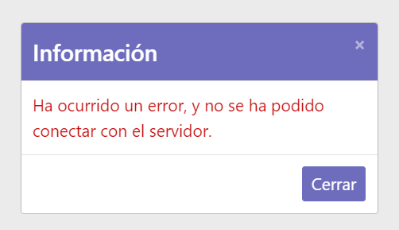
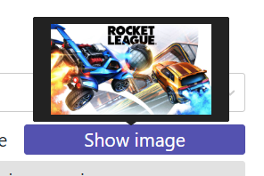

 

# Void Eye Game - Client
The client side application is the one that will be used by them, and the one that will query the data in the **server database through the API**, *repetitive requests are not a problem*, see [API](../void-eye-games-api) for more information.

<h2><strong style="color:red;">Important!! - Mandatory API</strong></h2>
It is mandatory to have the API installed and running locally for the correct functioning of the client side.

<h2><strong style="color:red;">Important!! - SSL Certs not included</strong></h2>
As you can understand, I can't provide application passwords/credentials/certificates, as this could bring security issues, for this project you can only run it in DEVELOPMENT mode (using `npm start` command), Yes even if you want to be able to put it into production, access the `.crt` folder in the project root folder, (relative path from which this file is located is: `../.crt`, if the folder does not exist, no hesitate to create it) in that folder you will save the server.crt and the server.key (the certificates)

## Requirements
Here you have the requiriments for **Web Client side**:
- [X] In production. (Speack with me to get the link)
### Common user
- [x] Home page
    - [x] Slider.
    - [x] News.
- [x] Games page
    - [x] Order By {name, price, plataform}.
    - [x] Categories filter.
    - [x] Plataforms filter.
- [x] Games details page
    - [x] Galery.
    - [x] Best plataforms to buy.
    - [x] The description.
    - [x] User comments.
- [x] Support page
    - [x] GeoLocation.
    - [x] Report form navigation button.
- [x] Report form View
- [x] Login form page
    - [x] [Optional] Recovery password.
- [x] Signin form View

### Logged users
- [x] Games details page
    - [x] Logged user can add Comments.

### Admin
- [x] Game form page
    - [x] A list of games to select which one do you want to edit.
    - [x] Add games.
    - [x] Add categories to game.
    - [x] Add images to game.
    - [x] Edit games.
- [x] Plataform form page
    - [x] A list of plataforms to select which one do you want to edit.
    - [x] Add plataforms.
    - [x] Add games to plataform with prices and discount of the plataform.
    - [x] Edit plataforms.
- [x] Categories form page
    - [x] A list of categories to select which one do you want to edit.
    - [x] Add category.
    - [x] Add games to category.
    - [x] Edit categories.

## User manual
In this *Users manual* you will see some showcases of Web Client **usage** and a **description** *explaining features and tips* for each page.

### Home page

The *home page* is the **main page or entrance to our web client**, here you can find a **slider** of those games that have a *discount applied to certain platforms*, and a **news** section where you will find *the latest games added to the platform*.

One *feature* of this page is that if you **cannot check the status/availability of the API**, a **modal dialog** will be displayed indicating that the API is currently unavailable, and it will not be possible to show you the games at that time.

### Games page
In the *games page* you will find a **aside of filters** and a **section where the filtered games will be listed**, **IMPORTANT!! games will not be filtered until you click the 'Filter' button**, however, the **search box** *in the menu bar at the top of the page does filter in* **real time**, constantly sending requests to the server due to which requires fewer resources.

The list of games is **paginated** and *12 games will be shown per page*, when you click **"show more"**, the following **12 games will be loaded**, the same thing happens in the case of *filters*, only these go from 5 to 5.

### Games details page
This is the most important page, in this we can find the details of a game, in these details enter:
- A gallery of medias (images and videos)
- The best three platforms in which the game is sold, *if you click on any you will be redirected to the platform page*.
- The description of the game.
- A comment section for users to share their experience with the game, **IMPORTANT! You can only comment if you are logged in**, and you can do it directly from the game details page.

### Support page
On the support page you can find out about who we are, how we work and where we are (thanks to a geolocation map), you can also access the error reporting form.

### Report form page
From the error report form, *whether you are registered or not*, you can *inform us* and *help us* **improve** the page, reporting **inaccurate prices**, or **bugs**.

### Login form page
On this page, you can **login**, or if **you don't have an account**, *you can access the page to register it*, you can also **recover your account password** on this page.

### Signin form page
On this page you can **register your user account**, as long as there is not already *one with the same name/email*.

### Game form page _Admin side_
**IMPORTANT! to this page only can be accessed by admin users accounts.**

On this page, you can **add/edit** games, **add categories to them**, **define a cover/main image for the game**, and **add media to the gallery**. (you will **not be able to add the game to the platforms** from this page).

#### Tips
On this page, you can find lists, if you **left or right click** on them, a **context menu will be displayed** that will *allow you to perform operations on these items*, in the case of **categories**, you can *delete* the category of this game, and in the case from the **gallery medias**, you can also *delete* them, **but in the case of images there is a special case, when you put the mouse over the item, the resource you have the mouse over will be shown (either image or video)**

### Plataform form page _Admin side_
**IMPORTANT! to this page only can be accessed by admin users accounts.**

On this page, you can create/edit platforms, and the games they sell on it, the platform will have a **(unique) name**, a **URL**, and an **image**, then it has a *list of games*, when you add a game, you can indicate its **price**, the **type of currency**, the **discount** in percentage (minimum 0, and max 1, 1 equals 100%) and finally, if the game is **currently for sale on that platform** (true or false).

#### Tips
In the *context menu of the items in the game list*, you will have **2 possible actions**, *delete* the game from the platform, or *edit* its features, in this way, we can edit the **price / type of currency / discount / if it is enabled in said platform**.

    

### Categories form page _Admin side_
**IMPORTANT! to this page only can be accessed by admin users accounts.**

On this page, you can *create/edit* categories, the categories only require a **unique name**, and they have a list where you can *add games* to this category, the **context menu** is simple, there is only **1 action** which is to **remove the game from this category**.
